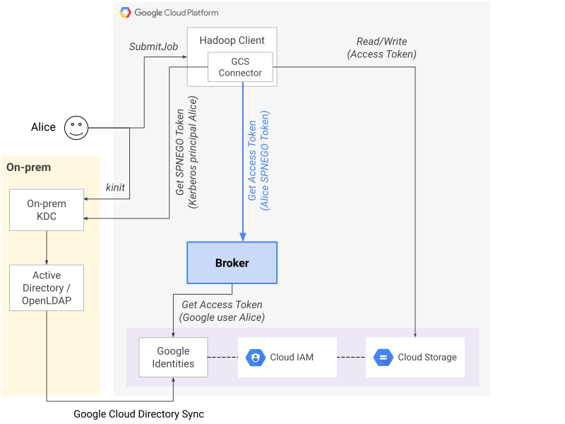
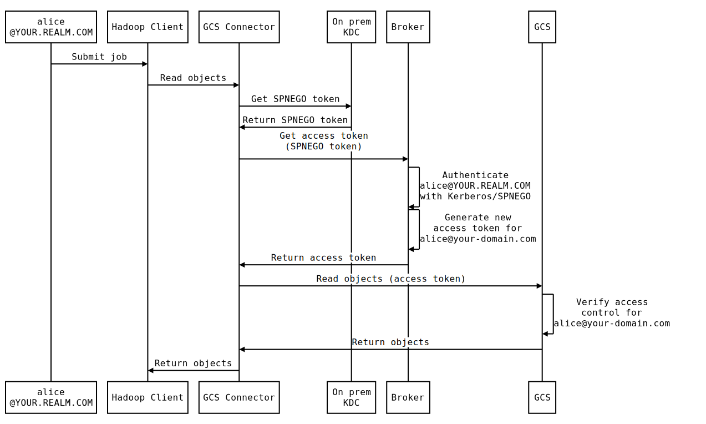
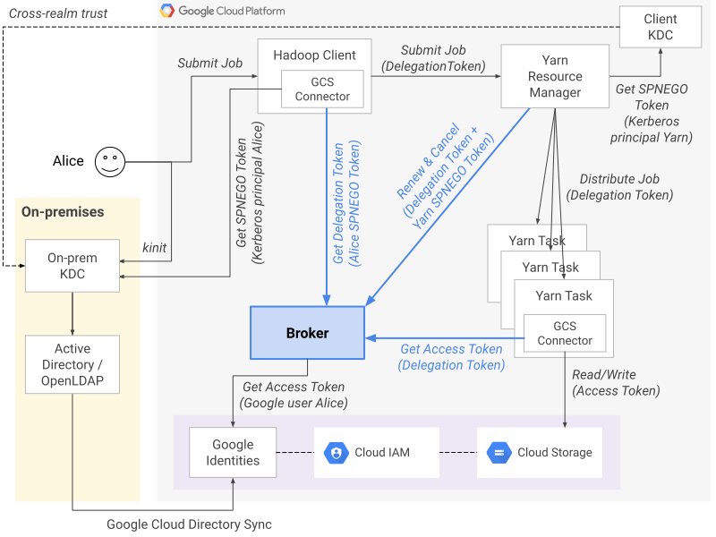
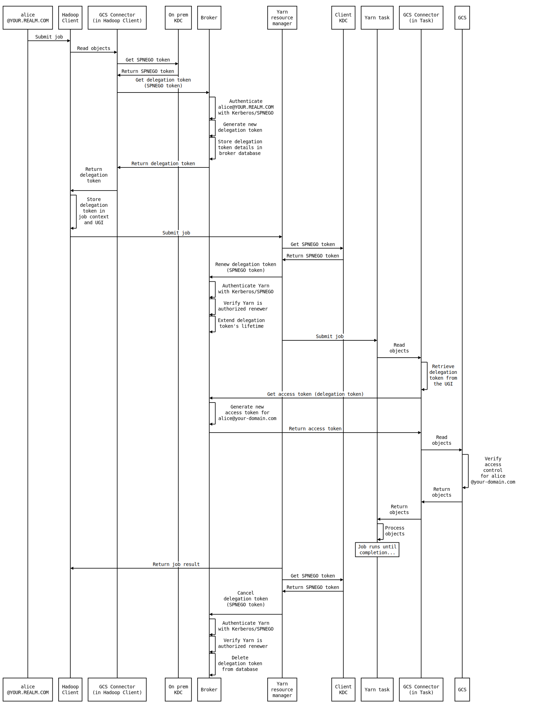

# GCP Token Broker

_**Notice**: This is an **alpha** release of the GCP Token Broker. This project might be changed in
backward-incompatible ways and is not subject to any SLA or deprecation policy._

**Table of contents:**

- [About this project](#about-this-project)
- [Repository's contents](#repositorys-contents)
- [Roadmap](#roadmap)
- [Design](#design)
  - [Direct authentication](#direct-authentication)
  - [Delegated authentication](#delegated-authentication)
  - [Proxy user impersonation](#proxy-user-impersonation)
- [Provisioning](#provisioning)
  - [Configuring the OAuth client](#configuring-the-oauth-client)
  - [Enabling audit logs for GCS](#enabling-audit-logs-for-gcs)
  - [Creating TLS certificates](#creating-tls-certificates)
  - [Using the authorizer](#using-the-authorizer)
  - [Creating a Dataproc cluster](#creating-a-dataproc-cluster)
  - [Uploading keytabs](#uploading-keytabs)
- [Production considerations](#production-considerations)
  - [Performance optimizations](#performance-optimizations)
    - [Caching](#caching)
    - [Scalable database](#scalable-database)
  - [Security hardening](#security-hardening)
    - [Project structure](#project-structure)
    - [IP-based controls](#ip-based-controls)
    - [Transport encryption](#transport-encryption)
    - [Storage encryption](#storage-encryption)
- [Test scenarios](#test-scenarios)
  - [Hadoop FS](#hadoop-fs)
  - [Yarn](#yarn)
  - [Hive](#hive)
  - [SparkSQL](#sparksql)
  - [Simulating the delegation token lifecycle](#simulating-the-delegation-token-lifecycle)
  - [What's next?](#whats-next)
- [Interacting with Redis](#interacting-with-redis)
- [Logging](#logging)
  - [GCS audit logs](#gcs-audit-logs)
  - [Broker application logs](#broker-application-logs)
- [Load testing](#load-testing)
- [How to Contribute](#how-to-contribute)


## About this project

The GCP Token Broker enables end-to-end Kerberos security and Cloud IAM integration for Hadoop
workloads on [Google Cloud Platform](https://cloud.google.com/) (GCP).

This project aims to achieve the following goals:

* Bridge the gap between Kerberos and Cloud IAM to allow users to log in with Kerberos and access GCP resources.
* Enable multi-tenancy for Hadoop clusters on Compute Engine and Cloud Dataproc.
* Enable user impersonation by Hadoop services such as Hive, Presto, or Oozie.

This project also strives to address the following requirements, which many enterprise customers have when
they're looking to migrate on-premise workloads to the cloud:

* All access to GCP resources (Cloud Storage, Google BigQuery, Cloud Bigtable, etc) should be attributable
  to the individual users who initiated the requests.
* No long-lived credentials should be stored on client machines or worker nodes.
* Cause as few changes as possible to existing on-premise security systems and user workflows.


## Repository's contents

This repository contains:

- `apps`: Server applications, including:
  - `authorizer`: Web UI for the OAuth flow that users must go through to authorize the broker service.
  - `broker`: The broker service itself.
- `deploy`: Helm charts for deploying the broker service and the authorizer app to a Kubernetes cluster.
- `connector`: Extension for the GCS Connector to allow Hadoop to communicate with the broker.
- `init-action`: Initialization action to install the broker dependencies in
  a Cloud Dataproc cluster.
- `load-testing`: Scripts for running loads tests for the broker service.
- `terraform`: Terraform scripts to deploy a sample demo environment. This is
  provided only as a reference and **_should not_** be used as-is in production.

## Roadmap

Included in the current **alpha** release:

* Full lifecycle of Hadoop-style delegation tokens: creation, renewal, cancellation.
* Support for Hadoop-style proxy users.
* Authentication backend: Kerberos.
* Target GCP service: Cloud Storage.
* Database backend: Cloud Datastore.
* Cache backend: Redis on Cloud Memorystore.

Plans for the **beta** & **stable** releases:

* Performance optimizations.
* Rewrite of server application from Python to Java.
* API stabilization.

Plans for **future** releases:

* Target GCP services: BigQuery, Cloud Bigtable, Cloud PubSub.
* Database backends: Cloud Firestore, Cloud Bigtable, MySQL, PostgreSQL.
* Cache backends: Memcached, Cloud Bigtable.
* Support for more authentication backends: TBD.

## Design

The broker's role is two-fold:

- Map Kerberos identities to [Google Cloud Identities](https://cloud.google.com/identity/).
- Generate access tokens to enable authenticated Kerberos principals to access GCP resources.

The following sub-sections describe how the broker enables different modes of authentication:
direct authentication, delegated authentication, and proxy-user impersonation.

### Direct authentication

With this mode of authentication, a user directly obtains an access token from the broker by
authenticating with Kerberos. The broker can authenticate the user by using a Kerberos keytab.
This mode of authentication is used for simple use cases, for example to list the contents of a bucket:

```shell
hadoop fs -ls gs://[my-bucket]
```

The following diagram illustrates the overall architecture for direct authentication:



The following sequence diagram describes the workflow for direct authentication:



### Delegated authentication

Delegated authentication is performed in more complex use cases that involve running a job across
multiple distributed tasks. For example:

```shell
hadoop jar wordcount.jar wordcount gs://[input-bucket]/data.txt gs://[output-bucket]
```

The broker's delegated authentication mechanism plugs into Hadoop's standard delegation token facilities.
This allows the broker to be compatible with many tools in the Hadoop ecosystem like Yarn, Spark, or Hive,
without any changes required for those tools.

The following diagram illustrates the overall architecture for delegated authentication:



The following sequence diagram describes the workflow for delegated authentication:



The renewal process is handled automatically by Yarn. Here is how it works:

1. The client calls the new GCS Connector extension's [`FileSystem.getDelegationToken`](https://github.com/apache/hadoop/blob/601b5038954bd3b44c02e58a2fbaa15082d8b54d/hadoop-common-project/hadoop-common/src/main/java/org/apache/hadoop/fs/FileSystem.java#L485)
   method, which instantiates a [`TokenIdentifier`](https://github.com/apache/hadoop/blob/601b5038954bd3b44c02e58a2fbaa15082d8b54d/hadoop-common-project/hadoop-common/src/main/java/org/apache/hadoop/security/token/TokenIdentifier.java),
   which calls the broker to obtain a new delegation token.
2. The client passes the delegation token to the job application context. The delegation token is also
   securely stored in the [UserGroupInformation](https://hadoop.apache.org/docs/current/api/org/apache/hadoop/security/UserGroupInformation.html)
   `currentUser`'s credentials.
3. The Yarn Resource Manager (YRM) calls the GCS Connector extension's [`TokenRenewer.renew`](https://github.com/apache/hadoop/blob/601b5038954bd3b44c02e58a2fbaa15082d8b54d/hadoop-common-project/hadoop-common/src/main/java/org/apache/hadoop/security/token/TokenRenewer.java#L57)
   method, which calls the broker to extend the delegation token's lifetime (configurable, defaults to 1 day).
   The YRM does this to verify that the "yarn" user is authorized to renew the delegation token and to catch
   potential issues early before submitting the job.
4. The job is submitted and the tasks start running.
5. When a task needs to access GCS, it calls the GCS Connector extension's [`AccessTokenProvider.refresh`](https://github.com/GoogleCloudPlatform/bigdata-interop/blob/61689bdd4e0dcdc3d2063952202f8f0fd7d39622/util-hadoop/src/main/java/com/google/cloud/hadoop/util/AccessTokenProvider.java#L53)
   method, which calls the broker to get a new access token, which is valid for 1 hour. The task then uses
   that access token to access GCS.
6. When the access token expires (after 1 hour), the next request to GCS fails. The GCS Connector detects the
   failure, calls the broker again and trades the delegation token for a new access token, then retries the GCS
   request with the new access token. The task's work then resumes as normal.
7. When a delegation token is at ~90% of its lifetime, the YRM calls the [`TokenRenewer.renew`](https://github.com/apache/hadoop/blob/601b5038954bd3b44c02e58a2fbaa15082d8b54d/hadoop-common-project/hadoop-common/src/main/java/org/apache/hadoop/security/token/TokenRenewer.java#L57)
   method again to extend the delegation token lifetime by another renewal period. This ensures that the
   delegation token used by the tasks remains valid for the entire duration of the job.
8. At the end of the job, the YRM calls the GCS Connector extension's [`TokenRenewer.cancel`](https://github.com/apache/hadoop/blob/601b5038954bd3b44c02e58a2fbaa15082d8b54d/hadoop-common-project/hadoop-common/src/main/java/org/apache/hadoop/security/token/TokenRenewer.java#L66)
   method, which calls the broker to cancel the delegation token. At that point, the delegation token
   is rendered unusable.

While the job is running, the broker keeps some details in its database about the session associated
with the delegation token:

- `id`: Automatically generated unique ID for the session.
- `creation_time`: Time at which the delegation token was created, that is, just before the job started.
- `expires_at`: Time at which the delegation token will expire. If the Yarn Resource Manager renews
  the token, then this time will be extended to some time in the future (24 hours later, by default).
- `owner`: Name of the original Kerberos principal who submitted the job.
- `renewer`: Name of the Kerberos principal who is authorized to renew and cancel the token.
- `scope`: Google API scope used to generate access tokens.
- `target`: Name of the bucket associated with the delegation token.
- `password`: Secret associated with the session. Used to validate that the delegation token
  provided by the client was in fact created by the broker.

### Proxy user impersonation

Principals for applications like Hive, Oozie, or Presto are typically configured as [proxy users](https://hadoop.apache.org/docs/current/hadoop-project-dist/hadoop-common/Superusers.html)
(also sometimes referred to as "super users"). The proxy user privilege allows those services to impersonate
other kerberized users, similarly to how the `root` user can impersonate any other users on Linux.
This allows, for example, Hive to execute the `UserGroupInformation:doAs()` method to read files from
HDFS on behalf of the user who is running a Hive query.

The broker can handle proxy users. For that, you just need to specify the list of authorized proxy users
in the broker's settings, for example:

```python
PROXY_USER_WHITELIST='hive/hive.your-domain.com@YOUR.REALM.COM,oozie/oozie.your-domain.com@YOUR.REALM.COM'
```

When a Hive job is running, the GCS connector calls the broker and sends a SPNEGO token for the
[logged-in principal](https://hadoop.apache.org/docs/current/api/org/apache/hadoop/security/UserGroupInformation.html#getLoginUser())
(e.g. "hive") in the request authentication header and the [`currentUser`](https://hadoop.apache.org/docs/current/api/org/apache/hadoop/security/UserGroupInformation.html#getCurrentUser())'s
username (e.g. "alice") as a request parameter. The broker then checks that the SPNEGO token's Kerberos
principal is in the `PROXY_USER_WHITELIST` setting, and if so, returns a GCP access token for the
"alice@your-domain.com" Cloud Identity.

## Provisioning

### Using Docker and GKE

If using Docker and GKE for development and deployment, see [GKE README](README_GKE.md).


### Configuring the OAuth client

1. Add an `A` DNS record in your domain registrar for your authorizer app's domain name.
   For the `A` record's IP address, use the IP returned by the following command:

   ```shell
   gcloud compute addresses describe authorizer-ip --global --format="value(address)"
   ```
2. Create an OAuth consent screen:
   * Go to: https://console.cloud.google.com/apis/credentials/consent
   * For "Application type", select "Internal".
   * For "Application name", type "GCP Token Broker".
   * For "Scopes for Google APIs", click "Add scope", then search for
     "Google Cloud Storage JSON API", then tick the checkbox for
     "auth/devstorage.read_write", then click "Add".
   * For "Authorized domains", type your domain name then press `Enter` on your keyboard
     to add it to the list.
   * Click "Save".
3. Create a new OAuth client ID:
   * Go to: https://console.cloud.google.com/apis/credentials
   * Click "Create credentials" > "OAuth client ID"
   * For "Application type", select "Web application".
   * For "Name", type "GCP Token Broker".
   * Leave "Authorized JavaScript origins" blank.
   * For "Authorized redirect URIs":
     - Type the following (Replace `[your.authorizer.hostname]` with your authorizer
       app's host name): `https://[your.authorizer.hostname]/google/auth`
     - Press "Enter" on your keyboard to add the URI to the list.
   * Click "Create".
   * Click "Ok" to close the confirmation popup.
   * Click the "Download JSON" icon for your client ID.
   * Move the downloaded JSON file to the code repository's root, then rename it to
     `client_secret.json`.

### Enabling audit logs for GCS

Follow these steps to enable GCS audit logs:

1. Go to: https://console.cloud.google.com/iam-admin/audit
2. In the "Filter table" text box, type "Google Cloud Storage" then press the "Enter" key.
3. Click on the "Google Cloud Storage" entry.
4. Tick the 3 checkboxes: "Admin Read", "Data Read", "Data Write".
5. Click "Save".

### Creating TLS certificates

The broker and authorizer apps both use TLS encryption when serving requests.

You may choose to use your own domain, certificates, and trusted Certificate
Authority. Alternatively, for development and testing purposes only,
you may create self-signed certificates as described below.

Run from the following commands from the root of the repository:

* Create broker certificate:

  ```shell
  BROKER_DOMAIN="10.2.1.255.xip.io"
  openssl genrsa -out broker-tls.key 2048
  openssl req -new -key broker-tls.key -out broker-tls.csr -subj "/CN=${BROKER_DOMAIN}"
  openssl x509 -req -days 365 -in broker-tls.csr -signkey broker-tls.key -out broker-tls.crt
  openssl pkcs8 -topk8 -nocrypt -in broker-tls.key -out broker-tls.pem
  ```
* Create authorizer certificate (Replace `[your.authorizer.hostname]` with your authorizer
  app's host name):

  ```shell
  AUTHORIZER_DOMAIN="[your.authorizer.hostname]"
  openssl genrsa -out authorizer-tls.key 2048
  openssl req -new -key authorizer-tls.key -out authorizer-tls.csr -subj "/CN=${AUTHORIZER_DOMAIN}"
  openssl x509 -req -days 365 -in authorizer-tls.csr -signkey authorizer-tls.key -out authorizer-tls.crt
  ```

### Using the authorizer

The Authorizer is a simple Web UI that users must use, only once, to authorize
the broker. The authorization process consists of a simple OAuth flow:

1. Open the authorizer page in your browser (`https://[your.authorizer.hostname]`).

   **Notes:**
   * If you're trying to access the authorizer page right after deploying
     the authorizer app with the `skaffold` command, your browser might return
     an error with a 502 code when loading the authorizer page. This means that the load
     balancer is still being deployed. It might take a few minutes for this deployment to complete.
     Wait for a few seconds, and then refresh the page. Try this until the page works and the
     authorizer UI appears.
   * If you used a self-signed certificate for the authorizer app, the browser will display
     a warning (In Chrome, you see a message that says "Your connection is not private").
     You can ignore this warning and proceed to loading the page (In Chrome, click the "Advanced"
     button then click the "Proceed" link).

2. Click "Authorize". You are redirected to the Google login page.
3. Enter the credentials for one of the three users you created in the [Prerequisites](#prerequisites) section.
4. Read the consent form, then click "Allow". You are redirected back to
   the authorizer page, and are greeted with a "Success" message. The
   broker now has authority to generate GCP access tokens on the user's behalf.

### Creating a Dataproc cluster

In this section, you create a Dataproc cluster to run sample Hadoop jobs and interact with the broker.

Run the following commands from the root of the repository:

1. Set an environment variable for the Kerberos realm (Replace `[ORIGIN.REALM.COM]` with the
   same Kerberos realm you used in the `terraform.tfvars` file):

   ```shell
   export REALM=[ORIGIN.REALM.COM]
   ```
2. Set a few more environment variables:

   ```shell
   export PROJECT=$(gcloud info --format='value(config.project)')
   export ZONE=$(gcloud info --format='value(config.properties.compute.zone)')
   export REGION=${ZONE%-*}
   export ORIGIN_KDC_HOSTNAME=$(gcloud compute instances describe origin-kdc --format="value(networkInterfaces[0].networkIP)").xip.io
   export BROKER_SERVICE_HOSTNAME="10.2.1.255.xip.io"
   export BROKER_VERSION=$(cat VERSION)
   ```
3. Create the Dataproc cluster:

   ```shell
   gcloud beta dataproc clusters create test-cluster \
     --optional-components KERBEROS \
     --single-node \
     --no-address \
     --zone $ZONE \
     --subnet client-subnet \
     --image-version 1.4 \
     --bucket ${PROJECT}-staging \
     --scopes cloud-platform \
     --service-account "dataproc@${PROJECT}.iam.gserviceaccount.com" \
     --initialization-actions gs://gcp-token-broker/broker-connector.${BROKER_VERSION}.sh \
     --properties "dataproc:kerberos.root.principal.password.uri=gs://${PROJECT}-secrets/root-password.encrypted,dataproc:kerberos.kms.key.uri=projects/$PROJECT/locations/$REGION/keyRings/dataproc-key-ring/cryptoKeys/dataproc-key,dataproc:kerberos.cross-realm-trust.realm=$REALM,dataproc:kerberos.cross-realm-trust.kdc=$ORIGIN_KDC_HOSTNAME,dataproc:kerberos.cross-realm-trust.admin-server=$ORIGIN_KDC_HOSTNAME,dataproc:kerberos.cross-realm-trust.shared-password.uri=gs://$PROJECT-secrets/shared-password.encrypted" \
     --metadata "gcp-token-broker-tls-enabled=true" \
     --metadata "gcp-token-broker-tls-certificate=$(cat broker-tls.crt)" \
     --metadata "gcp-token-broker-uri-hostname=$BROKER_SERVICE_HOSTNAME" \
     --metadata "gcp-token-broker-uri-port=443" \
     --metadata "origin-realm=$REALM" \
     --metadata "origin-kdc-hostname=$ORIGIN_KDC_HOSTNAME"
   ```

4. Display and take note of the Dataproc master VM's IP address:

   ```shell
   gcloud compute instances describe test-cluster-m --format="value(networkInterfaces[0].networkIP)"
   ```
5. Follow these steps to set the IP address in the broker KDC's Kerberos configuration file:
   * SSH into the broker KDC VM:

     ```shell
     gcloud beta compute ssh origin-kdc --tunnel-through-iap
     ```
   * Run the following command to set the correct IP address in `/etc/krb5.conf`
     (Replace `[your.dataproc.cluster.ip]` with the IP address you noted in the previous step):

     ```shell
     DATAPROC_KDC_IP=[your.dataproc.cluster.ip]
     sudo sed -i.bak -e "s/DATAPROC_KDC_IP/$DATAPROC_KDC_IP/" /etc/krb5.conf
     ```
   * Exit the SSH session:

     ```shell
     exit
     ```

### Uploading keytabs

The broker service needs keytabs (one for each realm) to authenticate incoming requests.

1. Download keytabs for the origin and Dataproc realms:

   ```shell
   # Download keytab for the origin realm
   gcloud beta compute ssh origin-kdc \
     --tunnel-through-iap \
     -- "sudo cat /etc/security/keytab/broker.keytab" | perl -pne 's/\r$//g' > origin.keytab

   # Download keytab for the Dataproc cluster's realm
   gcloud beta compute ssh test-cluster-m \
     --tunnel-through-iap \
     -- "sudo cat /etc/security/keytab/broker.keytab" | perl -pne 's/\r$//g' > dataproc.keytab

2. Upload the keytabs to the broker cluster:

   ```shell
   kubectl create secret generic broker-keytabs \
     --from-file=origin.keytab \
     --from-file=dataproc.keytab
   ```

3. Restart the broker Kubernetes pods:

   ```shell
   helm upgrade --recreate-pods -f deploy/values_override.yaml broker deploy/broker
   ```
4. You are now ready to do some testing. Refer to the [Test scenarios](#test-scenarios) section to run
   some sample Hadoop jobs and try out the broker's functionality.

## Production considerations

This section describes some tips to further improve the deployment process, performance, and
security in production environments.


### Performance optimizations

#### Caching

The broker application caches access tokens to account for the case where hundreds or thousands
of tasks might request an access token for the same user at the same time, for example at the beginning
of a large Map/Reduce job. This way, all tasks accessing the broker within the cache lifetime window
will share the same token. This allows to increase performance and to reduce load on the Google token API.

The broker application uses two types of caching:

* Remote caching: When a pod generates a new access token for a user, it encrypts the token with Cloud KMS,
  and caches the encrypted value in [Redis on Cloud Memorystore](https://cloud.google.com/memorystore/docs/redis/)
  for a short period of time, controlled by a setting (`ACCESS_TOKEN_REMOTE_CACHE_TIME`, defaults to 30 seconds).
* Local caching: When a pod obtains an access token for a user (either after generating it or pulling it from
  the remote cache), it caches the token unencrypted in its local memory for a short period of time, also
  controlled by a setting (`ACCESS_TOKEN_LOCAL_CACHE_TIME`, defaults to 60 seconds).

The two settings can be adjusted to tune up performance depending on the profile of the Hadoop cluster's workloads.

You can also select a different remote cache backend (e.g. Memcached) with the `REMOTE_CACHE` setting.

#### Scalable database

To do its work, the broker needs to store some state, most notably refresh tokens and broker session details.
[Cloud Datastore](https://cloud.google.com/datastore) is a great option because of its high scalability
and ease of use. For extreme loads, consider using [Cloud Bigtable](https://cloud.google.com/bigtable/)
instead for its sub-10ms latency. You can select your preferred database backend with the
`DATABASE_BACKEND` setting.

### Security hardening

This section describes different ways to further harden security for the deployment.

#### Project structure

The broker service has a lot of power as it holds sensitive secrets (e.g. refresh tokens)
and has the capacity to generate access tokens for other users. Therefore it is highly
recommended to keep the broker and its core components (Kubernetes cluster, cache, database, etc)
in a separate project, and to only allow a privileged group of admin users to access its
resources. Client machines can be allowed to access the broker service's API through private
network connectivity and via Kerberos authentication.

#### IP-based controls

It is recommended to restrict access to the broker service's API from specific client clusters.
This can be done by setting specific IP ranges for the [`loadBalancerSourceRanges`](https://kubernetes.io/docs/tasks/access-application-cluster/configure-cloud-provider-firewall/#restrict-access-for-loadbalancer-service)
parameter in the broker's Kubernetes configuration.

Access to GCS buckets can also be restricted by IP ranges using [VPC Service Controls](https://cloud.google.com/vpc-service-controls/docs/overview).

#### Transport encryption

Both the broker service and the authorizer app encrypt data transport with TLS. It is
highly recommended to use a trusted Certificate Authority to issue certificates for
those two apps in production.

#### Storage encryption

The broker encrypts refresh tokens before storing them in its database. The broker also encrypts
access tokens before storing them in its cache. Encryption is done using Cloud KMS keys that only
privileged admin users and the broker's service account should be given access to.

## Test scenarios

This section provides a few simple test scenarios that you can run on the test Dataproc cluster.
To SSH in the Dataproc cluster's master node, run this command:

```shell
gcloud beta compute ssh test-cluster-m --tunnel-through-iap
```

Once you're SSH'ed in, log in as one of your test users with Kerberos, for example:

```shell
kinit alice@$REALM
```

**Note:** For the sake of simplicity for the demo, the Kerberos passwords for the test users were
hardcoded in the demo's deployment (See the details in the [startup script template](./terraform/startup-script-kdc.tpl)
and the `kadmin.local` commands in the origin KDC's [terraform specification file](./terraform/origin_kdc.tf).
Those hardcoded passwords are the same as the usernames (e.g. the password for "alice@$REALM" is "alice").
Those hardcoded passwords are *not* the passwords that you would have set for the GSuite users in the [Prerequisites](#prerequisites)
section, as that would be the case in a production environment where the KDC's database would be synced with your
LDAP database.

Once the Kerberos user is logged-in, you are ready to run the commands in the test scenarios
described the following sub-sections. After each command, you can verify in the GCS audit logs
that the demo GCS bucket is in fact accessed by the expected GSuite user, that is
"alice@your-domain.com" (See the [Logging](#logging) section to learn how to iew the logs).

### Hadoop FS

Run a simple Hadoop FS command:

```shell
hadoop fs -ls gs://$PROJECT-demo-bucket/
```

This scenario uses the simple [direct authentication](#direct-authentication) workflow described earlier,
where Hadoop directly requests an access token from the broker to access GCS.

### Yarn

Run a simple wordcount job:

```shell
hadoop jar /usr/lib/hadoop-mapreduce/hadoop-mapreduce-examples.jar wordcount \
  gs://apache-beam-samples/shakespeare/macbeth.txt \
  gs://$PROJECT-demo-bucket/wordcount/output-$(uuidgen)
```

This scenario uses the [delegated authentication](#delegated-authentication) workflow, where the Hadoop
client first requests a delegation token from the broker, then passes the delegation token to the
Yarn workers, which then call the broker again to trade the delegation token for access tokens to access GCS.

### Hive

Here are some sample Hive queries you can run using the `hive` command:

1. Create a Hive table:

   ```shell
   hive -e "CREATE EXTERNAL TABLE transactions
            (SubmissionDate DATE, TransactionAmount DOUBLE, TransactionType STRING)
            STORED AS PARQUET
            LOCATION 'gs://$PROJECT-demo-bucket/datasets/transactions';"
   ```
2. Run a simple `SELECT` query:

   ```shell
   hive -e "SELECT * FROM transactions LIMIT 5;"
   ```
   This simple query only uses direct authentication.
3. Run a more complex query with some aggregations:

   ```shell
   hive -e "SELECT TransactionType, AVG(TransactionAmount) AS AverageAmount
            FROM transactions
            WHERE SubmissionDate = '2017-12-22'
            GROUP BY TransactionType;"
   ```
   This query is distributed across multiple tasks and therefore uses delegated
   authentication.

The same Hive queries can also be run using `beeline` as follows:

```shell
beeline -u "jdbc:hive2://localhost:10000/default;principal=hive/$(hostname -f)@$DATAPROC_REALM" \
  -e "CREATE EXTERNAL TABLE transactions
      (SubmissionDate DATE, TransactionAmount DOUBLE, TransactionType STRING)
      STORED AS PARQUET
      LOCATION 'gs://$PROJECT-demo-bucket/datasets/transactions';"

beeline -u "jdbc:hive2://localhost:10000/default;principal=hive/$(hostname -f)@$DATAPROC_REALM" \
  -e "SELECT * FROM transactions LIMIT 5;"

beeline -u "jdbc:hive2://localhost:10000/default;principal=hive/$(hostname -f)@$DATAPROC_REALM" \
  -e "SELECT TransactionType, AVG(TransactionAmount) AS AverageAmount
      FROM transactions
      WHERE SubmissionDate = '2017-12-22'
      GROUP BY TransactionType;"
```

To try different execution engines (Tez or MapReduce), add either one of the following
parameters:

* For Tez:

  ```shell
  --hiveconf="hive.execution.engine=tez"
  ```
* For Map Reduce:

  ```shell
  --hiveconf="hive.execution.engine=mr"
  ```

### SparkSQL

Follow these steps to test with SparkSQL:

1. Stark a Spark Shell session:

   ```shell
   spark-shell --conf "spark.yarn.access.hadoopFileSystems=gs://$PROJECT-demo-bucket"
   ```
2. Run the following Spark code:

   ```scala
   import org.apache.spark.sql.hive.HiveContext
   val hiveContext = new org.apache.spark.sql.hive.HiveContext(sc)
   hiveContext.sql("SELECT * FROM transactions LIMIT 5").show()
   ```
3. When you've finished your testing, exit the session:

   ```scala
   :q
   ```

### Simulating the delegation token lifecycle

Hadoop offers different commands to simulate the delegation token lifecycle.

In Hadoop v2.X, which comes pre-installed with Cloud Dataproc, you can use the
`hdfs fetchdt` command to simulate each step in the lifecycle to create, renew,
and cancel delegation tokens:

1. Get a delegation token for user `alice`:

   ```shell
   hdfs fetchdt -fs gs://$PROJECT-demo-bucket --renewer alice@$REALM ~/my.dt
   ```
   The delegation token is now stored in the `~/my.dt` file.
2. Renew the delegation token:

   ```shell
   hdfs fetchdt -fs gs://$PROJECT-demo-bucket --renew ~/my.dt
   ```
   The token's lifetime has now been extended.
3. Cancel the delegation token:

   ```shell
   hdfs fetchdt -fs gs://$PROJECT-demo-bucket --cancel ~/my.dt
   ```
   The token is now cancelled and made inoperable.

In Hadoop v3.X, the `hdfs fetchdt` command was deprecated and replaced with the `dtutil`
command. Cloud Dataproc currently doesn't support Hadoop v3, but if you have access to
a cluster with Hadoop v3, you can achieve the same tests as follows:

1. Get a delegation token:

   ```shell
   hadoop dtutil get gs://$PROJECT-demo-bucket -alias my-alias -renewer alice@$REALM  ~/my.dt
   ```
2. Renew the delegation token:

   ```shell
   hadoop dtutil renew -alias my-alias ~/my.dt
   ```
3. Cancel the delegation token:

   ```shell
   hadoop dtutil cancel -alias my-alias ~/my.dt
   ```

### What's next?

When you're done running the above test scenarios, you could try deploying larger Dataproc clusters
to run larger-scale tests. You could also adapt the provided Terraform scripts to integrate
the broker service with your stack and deploy it to your staging environment for
further testing.

## Interacting with Redis

To interact with the Redis database, first set up some environment variables
and functions:

```shell
REDIS_HOST=$(gcloud redis instances describe broker-cache --region $REGION --format="value(host)")

function redis-cli() {
  kubectl run -it --rm redis --image=redis --restart=Never --command -- redis-cli -h $REDIS_HOST $@
}
```

Then, here are some example Redis commands you can run:

* List keys in a DB number:

  ```shell
  redis-cli -n 0 keys '*'
  ```
* Flush all keys:

  ```shell
  redis-cli flushall
  ```

## Logging

### GCS audit logs

Follow these steps to view the GCS audit logs in Stackdriver:

1. Open the logs viewer in Stackdriver: https://console.cloud.google.com/logs/viewer
2. Click the down arrow in the text search box, then click "Convert to advanced filter".
3. Type the following in the text search box (Replace `[PROJECT-ID]` with your project ID):

   ```conf
   resource.type="gcs_bucket"
   resource.labels.bucket_name="[PROJECT-ID]-demo-bucket"
   logName="projects/[PROJECT-ID]/logs/cloudaudit.googleapis.com%2Fdata_access"
   ```
4. Click "Submit Filter".

### Broker application logs

Follow these steps to view the broker application logs in Stackdriver:

1. Open the logs viewer in Stackdriver: https://console.cloud.google.com/logs/viewer
2. Click the down arrow in the text search box, then click "Convert to advanced filter".
3. Type the following in the text search box:

   ```conf
   resource.type="container"
   resource.labels.cluster_name="broker"
   resource.labels.namespace_id="default"
   resource.labels.container_name="broker-container"
   ```
4. Click "Submit Filter".

## Load testing

This repository contains some load tests that use the [Locust](https://locust.io/) framework.

You can run the load tests from the sample Dataproc cluster that you created for the demo.

1. SSH into the Dataproc master instance:

   ```shell
   gcloud beta compute ssh test-cluster-m --tunnel-through-iap
   ```
2. Clone the project's repository:

   ```shell
   git clone https://github.com/GoogleCloudPlatform/gcp-token-broker
   cd gcp-token-broker/load-testing
   ```
3. Install some dependencies:

   ```shell
   ./install.sh
   ```
4. Create the Python gRPC stubs:

   ``shell
   python3 -m grpc_tools.protoc --proto_path=. --python_out=. --grpc_python_out=. brokerservice/protobuf/broker.proto
   ```
5. Create a `settings.py` file using the provided template.

   ```shell
   cp settings.py.template settings.py
   ```
6. Edit the `settings.py` to set appropriate values for your setup.
7. To run the load tests in headless mode:

   ```shell
   ~/.local/bin/locust --no-web -c 1000 -r 10
   ```
   The `-c` corresponds to the total number of users, and `-r` the hatch rate
   (i.e. the number of new users spawned each passing second). To stop the tests,
   press `ctrl-c`.
8. To run the tests using the Web UI, start the Locust server:

   ```shell
   ~/.local/bin/locust
   ```
   Then, in another terminal on your local machine, run the following command to set up
   a tunnel with the Dataproc master instance:

   ```shell
   gcloud beta compute start-iap-tunnel test-cluster-m 8089 \
   --local-host-port=localhost:8089
   --zone $ZONE
   ```
   Then open your browser at the address `http://localhost:8089`

Note: During the execution of load tests, you might see some errors: `Too many open files`.
This is because all users must read the Kerberos credentials from a temporary cache file,
and the limit of open files allowed by the OS might be reached. To increase the limit, run
the following command:

```shell
ulimit -n 32768
```

## Development

### Importing project into IntelliJ

Point IntelliJ to pom.xml to import as a Maven project.

### Building

Use `mvn package` to build shaded jar files with dependencies included for deployment. 


## How to Contribute

We'd love to accept your patches and contributions to this project. There are
just a few small guidelines you need to follow. See the [contributing guide](CONTRIBUTING.md)
for more details.
