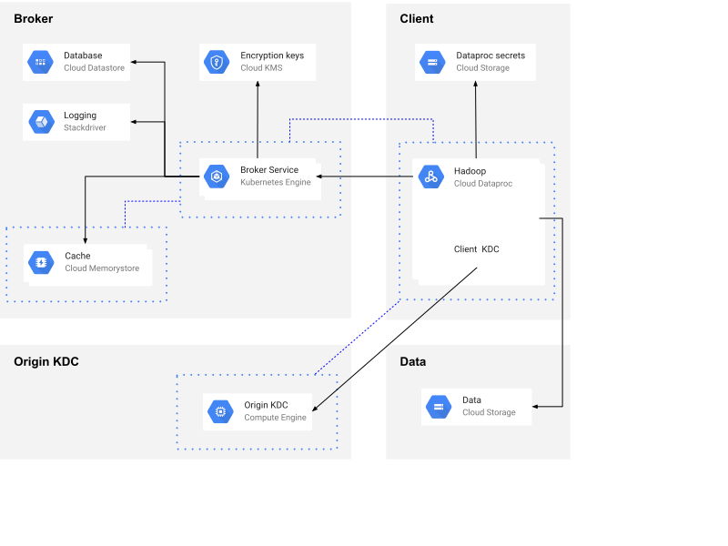

# GCP Token Broker Deployment on GKE

**Table of contents:**

- [Setting up local development environment](#setting-up-local-development-environment)
- [Creating a demo GCP environment](#creating-a-demo-gcp-environment)
  - [Prerequisites](#prerequisites)
  - [Deploying the demo architecture](#deploying-the-demo-architecture)
  - [Deployment process](#deployment-process)
    - [Configuration management](#configuration-management)
    - [Building containers](#building-containers)
    - [Deploying the broker service](#deploying-the-broker-service)
    - [Scaling out workers](#scaling-out-workers)

## Setting up local development environment

This section contains some tips if you're interested in making code contributions to this project.

Start a development container:

```shell
docker run -it -v $PWD:/base -w /base --detach --name broker-dev ubuntu:18.04
docker exec -it broker-dev bash -- apps/broker/install-dev.sh
```

To compile the broker service app:

```shell
docker exec -it broker-dev bash -c 'cd apps/broker; mvn package'
```

To compile the broker connector:

```shell
docker exec -it broker-dev bash -c 'cd connector; mvn package -Phadoop2'
```


## Creating a demo GCP environment

This section describes how to set up a demo environment to test the broker service.

**_Important note:_ The following instructions are provided only as a reference
to create the demo environment and _should not_ be used as-is in production.**

The demo environment will help you understand and test the broker's functionality in a practical way.
Once you become familiar with the broker's codebase and functionality, you can look to adapt the demo
to your production or staging environments (For more details on that, refer to the
"[Production considerations](#production-considerations)" section).

The following diagram illustrates the demo environment's architecture:



Notes about the architecture:

* The broker's server application is implemented in Python and is deployed with Kubernetes on [Kubernetes Engine](https://cloud.google.com/kubernetes-engine/).
  The broker's Kubernetes spec automatically deploys an internal load balancer to balance traffic across
  the broker server pods.
* Interactions between clients and the broker is done with gRPC and protocol buffers.
* The Origin KDC is the source of truth for Kerberos users. Alternatively it could be replaced with
  an Active Directory or Open LDAP instance.
* All machines for the broker, KDC, and clients are deployed in private networks with RFC 1918 IP addresses.
  [Cloud NAT](https://cloud.google.com/nat/docs/overview) gateways are deployed for cases where machines need
  to access the internet. Private connectivity between Hadoop client machines (e.g. on [Compute Engine](https://cloud.google.com/compute/)
  or [Cloud Dataproc](https://cloud.google.com/dataproc/)), the broker service, and the Origin KDC is
  established over [VPC peering](https://cloud.google.com/vpc/docs/vpc-peering). Alternatively, private connectivity could also be
  established with [Cloud VPN](https://cloud.google.com/vpn/docs/concepts/overview) or [Shared VPC](https://cloud.google.com/vpc/docs/shared-vpc).
  [Google Private Access](https://cloud.google.com/vpc/docs/private-access-options#pga) is enabled on the VPC subnets to allow machines to access
  Google services like Cloud Datastore, Cloud Storage or Cloud KMS.

### Prerequisites

Before you start, you must set up some prerequisites for the demo:

1. Register a new domain name with your preferred domain registrar. This is recommended so you can
   test in a self-contained environment.
2. [Create a new GSuite organization](https://gsuite.google.com/signup/gcpidentity/welcome) associated with the new domain name.
3. [Create](https://support.google.com/a/answer/33310?hl=en) 3 new non-admin users in the organization (e.g. "alice", "bob", and "john").
4. Create a new GCP project under the GSuite organization and [enable billing](https://cloud.google.com/billing/docs/how-to/modify-project).
5. Install some tools on your local machine (The versions indicated below are the ones that have been officially tested.
   Newer versions might work but are untested):
   * [Terraform](https://learn.hashicorp.com/terraform/getting-started/install.html) v0.11.13
   * [Helm](https://docs.helm.sh/using_helm/#installing-helm) v2.13.1
   * [Skaffold](https://github.com/GoogleContainerTools/skaffold#install) v0.26.0
   * [Google Cloud SDK](https://cloud.google.com/sdk/install) v242.0.0
   


### Deploying the demo architecture

The demo enviromnent is comprised of multiple components and GCP products (Cloud Datastore, Cloud Memorystore,
VPCs, firewall rules, etc.), which are automatically deployed using terraform.

Follow these steps to deploy the demo environment to GCP:

1. Log in as the Google user who owns the GCP project:

   ```shell
   gcloud auth application-default login
   ```
2. Run the following commands to set some default configuration values for `gcloud`.
   Replace `[your-project-id]` with your GCP project ID, and `[your-zone-of-choice]`
   with your preferred zone (See list of [availables zones](https://cloud.google.com/compute/docs/regions-zones/#available)):

   ```shell
   gcloud config set project [your-project-id]
   gcloud config set compute/zone [your-zone-of-choice]
   ```
3. Change into the `terraform` directory:

   ```shell
   cd terraform
   ```
4. Create a `terraform.tfvars` file in the `terraform` directory with the following configuration
   (Update the values as needed. Also make sure to use the same `gcp_zone` as you
   selected in the above step, and its corresponding `gcp_region`):

   ```conf
   gcp_project = "[your-project-id]"
   gcp_region = "us-west1"
   gcp_zone = "us-west1-a"
   datastore_region = "us-west2"
   domain = "[your.domain.name]"
   authorizer_hostname = "[your.authorizer.hostname]"
   origin_realm = "[YOUR.REALM.NAME]"
   test_users = ["alice", "bob", "john"]
   ```

   Notes:
   * `domain` is the domain name (e.g. "your-domain.com") that you registered in the [Prerequisites](#prerequisites)
     section for your GSuite organization.
   * `datastore_region` is the region for your Cloud Datastore database. See the list of
     [available regions](https://cloud.google.com/datastore/docs/locations#location-r) for Cloud Datastore.
   * `authorizer_hostname` is the host name (e.g. "authorizer.your-domain.com") that
     you wish to use to access the authorizer app. This value will be used to configure the
     authorizer app's load balancer.
   * `origin_realm` is the Kerberos realm (e.g. "YOUR-DOMAIN.COM") that you wish
     to use for your test users. This value can be a totally arbitrary string, and is
     generally made of UPPERCASE letters.
   * Replace the `test_users` with the usernames of the three users that you created in the
     [Prerequisites](#prerequisites) section.
5. Run: `terraform init`
6. Run: `terraform apply`


### Deployment process

#### Configuration management

Note that the Terraform scripts provided in this repository are provided only as a reference to
set up a demo environment. You can use those scripts as a starting point to create your own
scripts for Terraform or your preferred configuration management tool to deploy the broker
service to production or staging environment.

#### Building containers

The demo uses Skaffold to build and deploy the applications containers. Note that Skaffold
is mainly suitable for development purposes. In production, you should build and deploy the
application containers directly with `docker`.

To build the containers:

```shell
# Broker service
docker build -f ./apps/broker/Dockerfile -t gcr.io/$PROJECT/broker .
docker push gcr.io/$PROJECT/broker

# Authorizer
docker build -f ./apps/authorizer/Dockerfile -t gcr.io/$PROJECT/authorizer .
docker push gcr.io/$PROJECT/authorizer
```

To deploy with Helm and Kubernetes:
```shell
helm install -f deploy/values_override.yaml --name broker deploy/broker
helm install -f deploy/values_override.yaml --name authorizer deploy/authorizer
```

To delete the deployments:
```shell
helm delete broker --purge
helm delete authorizer --purge
```


#### Deploying the broker service

To deploy the broker service, run the following commands from the root of the repository:

1. Download the broker app's JAR:

   ```
   export BROKER_VERSION=$(cat VERSION)
   mkdir -p apps/broker/target
   curl https://repo1.maven.org/maven2/com/google/cloud/broker/broker/$BROKER_VERSION/broker-$BROKER_VERSION-jar-with-dependencies.jar > apps/broker/target/broker-$BROKER_VERSION-jar-with-dependencies.jar
   ```
2. Set some environment variables:

   ```shell
   export PROJECT=$(gcloud info --format='value(config.project)')
   export ZONE=$(gcloud info --format='value(config.properties.compute.zone)')
   ```
3. Configure credentials for the cluster:

   ```shell
   gcloud container clusters get-credentials broker
   ```
4. Create a Kubernetes service account with the cluster admin role for Tiller, the Helm server:

   ```shell
   kubectl create serviceaccount --namespace kube-system tiller
   kubectl create clusterrolebinding tiller --clusterrole=cluster-admin --serviceaccount=kube-system:tiller
   ```
5. Install Helm tiller in the cluster:

   ```shell
   helm init --service-account tiller
   ```
6. Create the Broker secrets:

   ```shell
   kubectl create secret generic broker-secrets \
     --from-file=client_secret.json \
     --from-file=tls.pem=broker-tls.pem \
     --from-file=tls.crt=broker-tls.crt
   ```
7. Create the Authorizer secrets

   ```shell
   openssl rand -base64 32 > authorizer-flask-secret.key

   kubectl create secret generic authorizer-secrets \
     --from-file=client_secret.json \
     --from-file=authorizer-flask-secret.key \
     --from-file=tls.key=authorizer-tls.key \
     --from-file=tls.crt=authorizer-tls.crt
   ```
8. Create the `skaffold.yaml` configuration file:

   ```shell
   cd deploy
   sed -e "s/PROJECT/$PROJECT/" skaffold.yaml.template > skaffold.yaml
   ```
9.  Deploy to Kubernetes Engine:

   ```shell
   skaffold dev -v info
   ```

   Note: The first time you run the `skaffold` command, it might take a few
   minutes for the container images to build and get uploaded to the
   container registry.

11. Wait until an external IP has been assigned to the broker service. You can
   check the status by running the following command in a different terminal,
   and by looking up the `EXTERNAL-IP` value:

   ```shell
   kubectl get service broker-service
   ```


#### Scaling out workers

[Kubernetes Engine](https://cloud.google.com/kubernetes-engine/) is a great platform
for running the broker server application. This allows you to scale out the number
of workers in multiple, combinable ways:

* Number of deployed Kubernetes nodes, that is the number of VMs in the Kubernetes cluster,
  by resizing the cluster:

  ```shell
  gcloud container clusters resize broker --size <NEW_NUMBER_OF_NODES>
  ```
* Number of Kubernetes pods, that is the number of running broker containers in the Kubernetes cluster,
  by increasing the `broker.replicaCount` value for the Helm chart and then running the
  following command:

  ```shell
  helm upgrade -f <VALUE_FILE.yaml> broker deploy/broker
  ```
* Number of threads, i.e. the number of gRPC server instances running in each container,
  by changing the `NUM_SERVER_THREADS` broker setting.

You can also scale up each Kubernetes node by increasing memory and CPU resources to accommodate
for more workers.